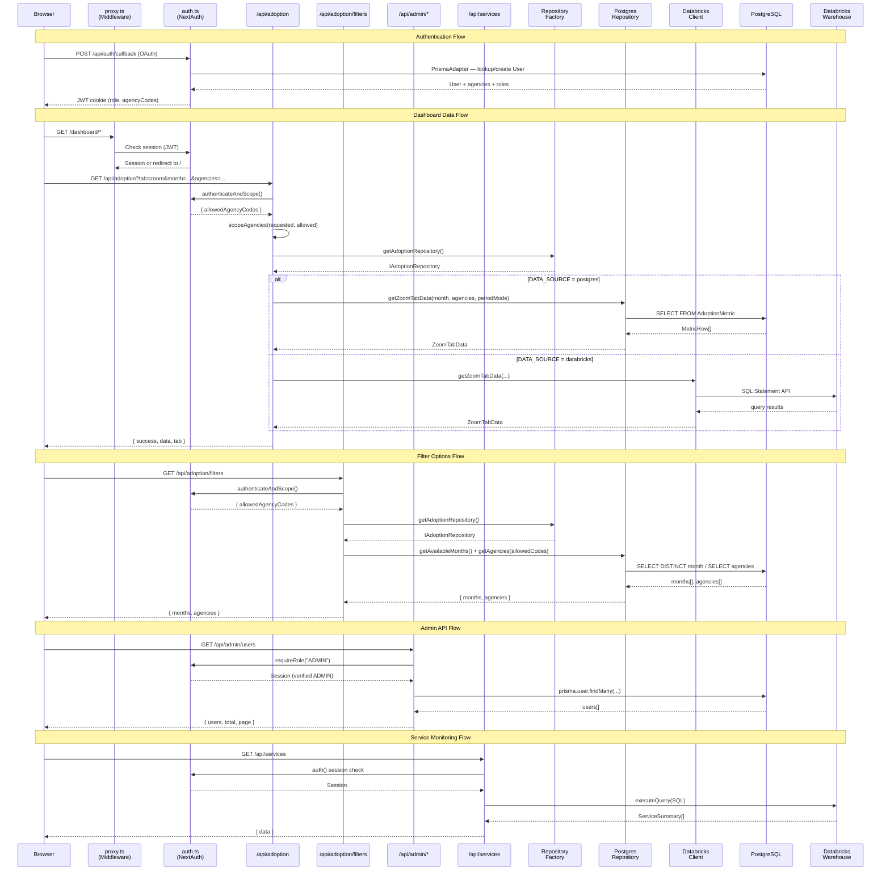
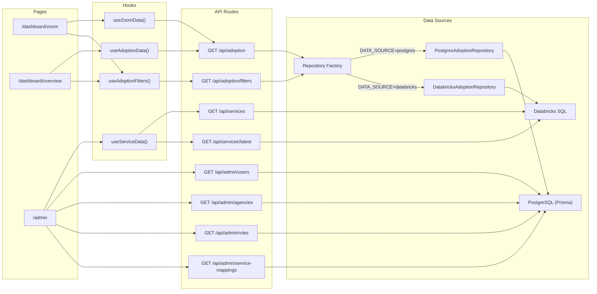

# Spectra POC — Architecture Diagram

## API Call Flow

```mermaid
sequenceDiagram
    participant Browser
    participant Middleware as proxy.ts<br/>(Middleware)
    participant Auth as auth.ts<br/>(NextAuth)
    participant AdoptionAPI as /api/adoption
    participant FiltersAPI as /api/adoption/filters
    participant AdminAPI as /api/admin/*
    participant ServicesAPI as /api/services
    participant RepoFactory as Repository<br/>Factory
    participant Postgres as Postgres<br/>Repository
    participant Databricks as Databricks<br/>Client
    participant DB as PostgreSQL
    participant DBricks as Databricks<br/>Warehouse

    Note over Browser,DBricks: Authentication Flow
    Browser->>Auth: POST /api/auth/callback (OAuth)
    Auth->>DB: PrismaAdapter — lookup/create User
    DB-->>Auth: User + agencies + roles
    Auth-->>Browser: JWT cookie (role, agencyCodes)

    Note over Browser,DBricks: Dashboard Data Flow
    Browser->>Middleware: GET /dashboard/*
    Middleware->>Auth: Check session (JWT)
    Auth-->>Middleware: Session or redirect to /

    Browser->>AdoptionAPI: GET /api/adoption?tab=zoom&month=...&agencies=...
    AdoptionAPI->>Auth: authenticateAndScope()
    Auth-->>AdoptionAPI: { allowedAgencyCodes }
    AdoptionAPI->>AdoptionAPI: scopeAgencies(requested, allowed)
    AdoptionAPI->>RepoFactory: getAdoptionRepository()
    RepoFactory-->>AdoptionAPI: IAdoptionRepository

    alt DATA_SOURCE = postgres
        AdoptionAPI->>Postgres: getZoomTabData(month, agencies, periodMode)
        Postgres->>DB: SELECT FROM AdoptionMetric
        DB-->>Postgres: MetricRow[]
        Postgres-->>AdoptionAPI: ZoomTabData
    else DATA_SOURCE = databricks
        AdoptionAPI->>Databricks: getZoomTabData(...)
        Databricks->>DBricks: SQL Statement API
        DBricks-->>Databricks: query results
        Databricks-->>AdoptionAPI: ZoomTabData
    end

    AdoptionAPI-->>Browser: { success, data, tab }

    Note over Browser,DBricks: Filter Options Flow
    Browser->>FiltersAPI: GET /api/adoption/filters
    FiltersAPI->>Auth: authenticateAndScope()
    Auth-->>FiltersAPI: { allowedAgencyCodes }
    FiltersAPI->>RepoFactory: getAdoptionRepository()
    RepoFactory-->>FiltersAPI: IAdoptionRepository
    FiltersAPI->>Postgres: getAvailableMonths() + getAgencies(allowedCodes)
    Postgres->>DB: SELECT DISTINCT month / SELECT agencies
    DB-->>Postgres: months[], agencies[]
    Postgres-->>FiltersAPI: { months, agencies }
    FiltersAPI-->>Browser: { months, agencies }

    Note over Browser,DBricks: Admin API Flow
    Browser->>AdminAPI: GET /api/admin/users
    AdminAPI->>Auth: requireRole("ADMIN")
    Auth-->>AdminAPI: Session (verified ADMIN)
    AdminAPI->>DB: prisma.user.findMany(...)
    DB-->>AdminAPI: users[]
    AdminAPI-->>Browser: { users, total, page }

    Note over Browser,DBricks: Service Monitoring Flow
    Browser->>ServicesAPI: GET /api/services
    ServicesAPI->>Auth: auth() session check
    Auth-->>ServicesAPI: Session
    ServicesAPI->>DBricks: executeQuery(SQL)
    DBricks-->>ServicesAPI: ServiceSummary[]
    ServicesAPI-->>Browser: { data }
```

## Component → Hook → API Mapping

```mermaid
graph LR
    subgraph Pages
        ZoomPage["/dashboard/zoom"]
        OverviewPage["/dashboard/overview"]
        AdminPage["/admin"]
    end

    subgraph Hooks
        useZoomData["useZoomData()"]
        useAdoptionData["useAdoptionData()"]
        useAdoptionFilters["useAdoptionFilters()"]
        useServiceData["useServiceData()"]
    end

    subgraph API Routes
        AdoptionRoute["GET /api/adoption"]
        FiltersRoute["GET /api/adoption/filters"]
        ServicesRoute["GET /api/services"]
        ServicesLatest["GET /api/services/latest"]
        AdminUsers["GET /api/admin/users"]
        AdminAgencies["GET /api/admin/agencies"]
        AdminRoles["GET /api/admin/roles"]
        AdminMappings["GET /api/admin/service-mappings"]
    end

    subgraph Data Sources
        RepoFactory["Repository Factory"]
        PostgresRepo["PostgresAdoptionRepository"]
        DatabricksRepo["DatabricksAdoptionRepository"]
        PrismaDB["PostgreSQL (Prisma)"]
        DatabricksDB["Databricks SQL"]
    end

    ZoomPage --> useZoomData
    ZoomPage --> useAdoptionFilters
    OverviewPage --> useAdoptionData
    OverviewPage --> useAdoptionFilters
    AdminPage --> useServiceData

    useZoomData --> AdoptionRoute
    useAdoptionData --> AdoptionRoute
    useAdoptionFilters --> FiltersRoute
    useServiceData --> ServicesRoute
    useServiceData --> ServicesLatest

    AdminPage --> AdminUsers
    AdminPage --> AdminAgencies
    AdminPage --> AdminRoles
    AdminPage --> AdminMappings

    AdoptionRoute --> RepoFactory
    FiltersRoute --> RepoFactory
    RepoFactory -->|DATA_SOURCE=postgres| PostgresRepo
    RepoFactory -->|DATA_SOURCE=databricks| DatabricksRepo
    PostgresRepo --> PrismaDB
    DatabricksRepo --> DatabricksDB

    ServicesRoute --> DatabricksDB
    ServicesLatest --> DatabricksDB
    AdminUsers --> PrismaDB
    AdminAgencies --> PrismaDB
    AdminRoles --> PrismaDB
    AdminMappings --> PrismaDB
```
